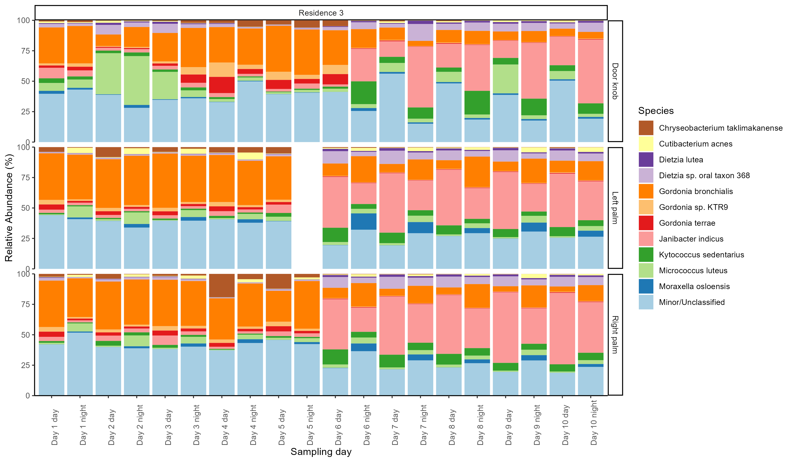
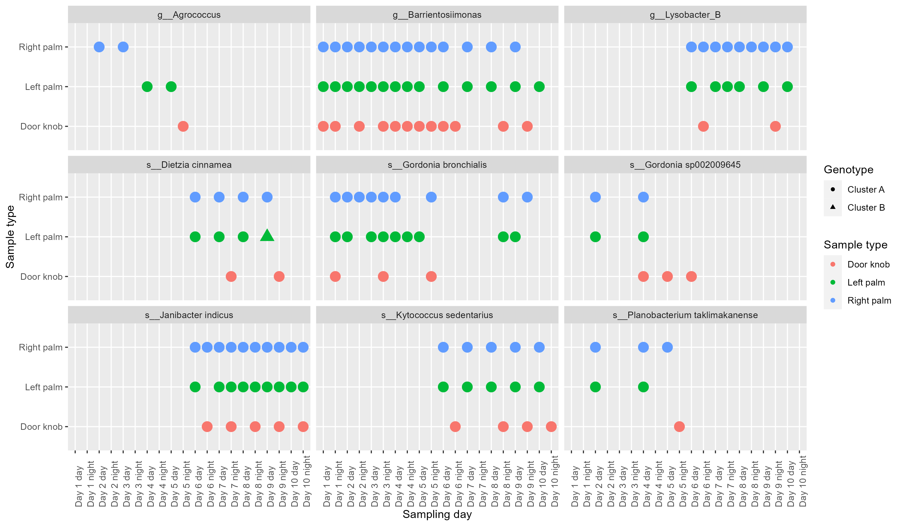
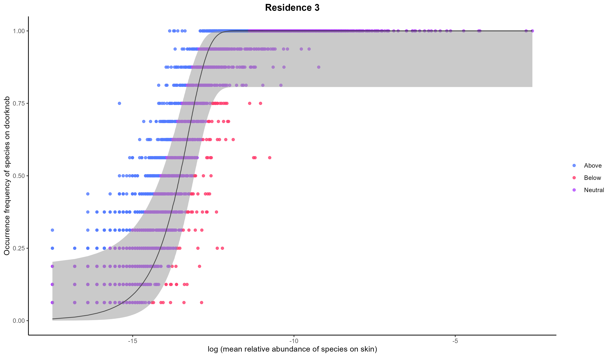
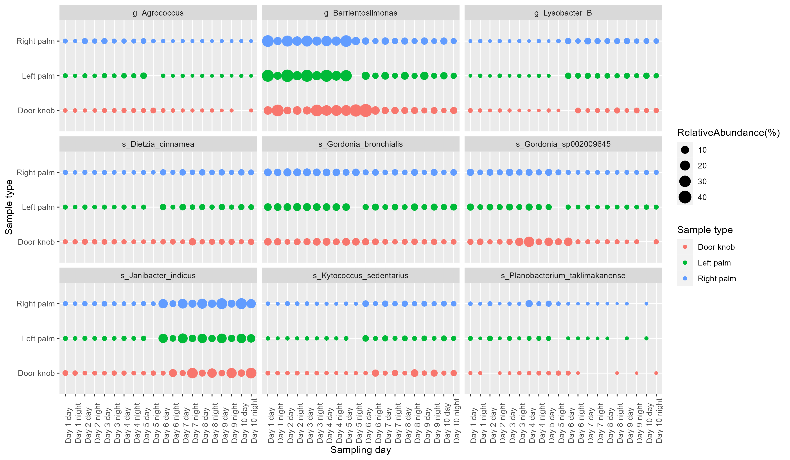

# Microbial Metagenomics Portfolio

This repository packages a representative undergraduate research project in microbial metagenomics into a GitHub-friendly format. It combines the original lab notebook export, reconstructed analysis scripts, result figures, and thesis documents so a reviewer can quickly see both the coding work and the scientific outcome.

If you want the entire process and code in one reviewer-friendly document, start with `PROJECT_STORY.Rmd`.

## Project Focus

This project investigates microbial transmission and community structure across household surfaces and skin samples using a metagenomics workflow. The work includes:

- quality control and read preprocessing
- host decontamination
- assembly and binning
- taxonomic profiling
- genome dereplication and abundance tracking
- downstream statistical analysis and visualization in R

## What This Repo Shows

- `docs/final-report.pdf`: final written thesis report
- `docs/rehearsal-slides.pdf`: rehearsal slides showing project progress before the final report
- `PROJECT_STORY.Rmd`: a single-file narrative walkthrough of the full pipeline, process, and code
- `notebook_export/data-analysis-script-and-output.md`: original exported lab notebook containing the full collected command history, analysis notes, and figure outputs
- `scripts/`: curated standalone scripts reconstructed from the notebook export for easier browsing
- `figures/`: result figures produced during the project

## Workflow Overview

1. `FastQC` and `MultiQC` for read quality assessment
2. `AdapterRemoval` for adapter trimming
3. `KneadData` for decontamination and cleaning
4. `metaWRAP` for assembly, binning, and refinement
5. `Kraken2` and related downstream summaries for taxonomic profiling
6. `CheckM`, `GTDB-Tk`, `dRep`, and `CoverM` for genome quality, taxonomy, dereplication, and abundance estimation
7. `R` and `Python` scripts for post-processing, plotting, and interpretation

## Repository Layout

```text
microbial-metagenomics-thesis-portfolio/
├── assets/
├── docs/
├── figures/
├── notebook_export/
└── scripts/
```

## Project Progression

The repository intentionally includes both intermediate and final artifacts:

- the rehearsal PDF shows how the project was presented during development
- the final report shows the completed scientific narrative
- the notebook export preserves the original analysis workflow and command history

## Selected Visual Outputs

### Thesis Preview


### Result Figures









## Notes For Reviewers

- Raw sequencing data are not included because of size and storage constraints.
- Many file paths in the scripts reflect the original HPC environment used during the project.
- The original notebook export is preserved as the authoritative source.
- The standalone scripts in `scripts/` were lightly cleaned and separated for readability, while keeping the original logic and tool choices.
